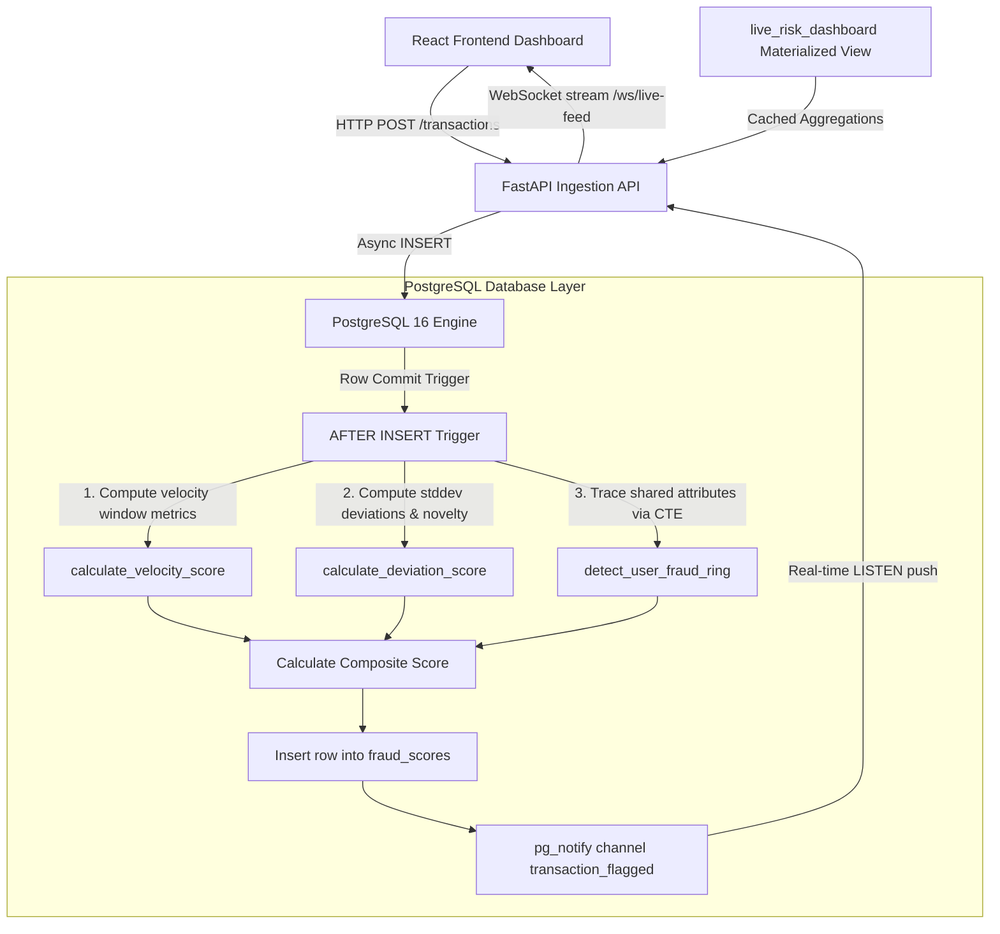

# FraudNet 🛡️ — SQL-Native Real-Time Fraud Detection Engine

FraudNet is an enterprise-grade real-time financial fraud detection system where the core detection intelligence is executed **entirely inside PostgreSQL 16 (PL/pgSQL)** using triggers, advanced window functions, and recursive Common Table Expressions (CTEs). 

FastAPI serves as a thin ingestion shell that acts as an asynchronous WebSocket bridge, forwarding events to a React dashboard.

---

## 🏗️ Architecture



---

## ⚡ Why SQL-Native? (The Design Tradeoff)

Traditional architectures process fraud logic in application services (e.g., Python/Go workers). FraudNet moves this calculation directly to the **PostgreSQL storage layer**.

### Advantages:
1. **Zero Network Round-Trips**: Computing rolling counts, user baselines, and network graphs in python requires fetching hundreds of historic records per transaction. In SQL, this data is already in memory.
2. **Strict Transaction Isolation & Atomicity**: The score is computed *before* the transaction is fully committed. There is no race condition where a high-velocity attack can slip through in a split-second window before a Python background worker processes it.
3. **Database-enforced Integrity**: Fraud scores and flagged alerts are generated deterministically for every transaction, regardless of which client or API ingested it.

### Tradeoffs:
* **Horizontal Scaling Constraints**: CPU scaling is shifted to PostgreSQL. Sharding or read-replicas are required if the database becomes a bottleneck.
* **Logic Portability**: Migrating from PostgreSQL to Spanner or BigQuery would require rewriting the PL/pgSQL procedures.

---

## 🕸️ Recursive CTE Fraud Ring Tracing Explained

The centerpiece of FraudNet is its graph-based fraud ring discovery logic. A fraud ring is a cluster of users linked by shared attributes: same `device_id`, same `ip_address`, or credit cards sharing the same `last_four` digits.

### The Recursive Algorithm (`detect_fraud_rings()`)

```sql
WITH RECURSIVE bidirectional_links AS (
    -- Link users sharing device fingerprints
    SELECT DISTINCT t1.user_id AS user_a, t2.user_id AS user_b
    FROM transactions t1
    JOIN transactions t2 ON t1.device_id = t2.device_id WHERE t1.user_id != t2.user_id
    UNION
    -- Link users sharing IP addresses
    SELECT DISTINCT t1.user_id AS user_a, t2.user_id AS user_b
    FROM transactions t1
    JOIN transactions t2 ON t1.ip_address = t2.ip_address WHERE t1.user_id != t2.user_id
    UNION
    -- Link users sharing credit cards with identical last 4 digits
    SELECT DISTINCT c1.user_id AS user_a, c2.user_id AS user_b
    FROM cards c1
    JOIN cards c2 ON c1.last_four = c2.last_four WHERE c1.user_id != c2.user_id
),
graph_search(start_user, current_user, path) AS (
    -- Base Case: Seed path with all starting vertices (users)
    SELECT DISTINCT user_a, user_a, ARRAY[user_a] FROM bidirectional_links
    UNION ALL
    -- Recursive Step: Join back to links to walk outward to unvisited neighbors
    SELECT gs.start_user, bl.user_b, gs.path || bl.user_b
    FROM graph_search gs
    JOIN bidirectional_links bl ON gs.current_user = bl.user_a
    WHERE NOT (bl.user_b = ANY(gs.path)) -- Cycle prevention check
)
...
```

### Worked Trace Example

Suppose we have the following relationships in our database:
* **User 1** transacts on `dev_A`
* **User 2** transacts on `dev_A` and from `192.168.1.1`
* **User 3** transacts from `192.168.1.1`
* **User 4** shares a card `last_four` (`4321`) with **User 3**, but uses `dev_B` (User 4 is connected to User 3, which connects them to User 2 and User 1).

The links will be populated as:
* `1-2` (via device `dev_A`)
* `2-3` (via IP `192.168.1.1`)
* `3-4` (via card last 4 `4321`)

Here is how the Recursive CTE evaluates the component starting from **User 1**:

1. **Iteration 0 (Base Case)**:
   * Path: `ARRAY[1]`, `current_user = 1`.
2. **Iteration 1**:
   * Finds neighbor `2` from `bidirectional_links`.
   * Checks if `2` is in path `[1]`. (No).
   * Path becomes `[1, 2]`, `current_user = 2`.
3. **Iteration 2**:
   * Finds neighbors of `2`: `1` and `3`.
   * Checks `1` in path `[1, 2]` (Yes - rejected to prevent infinite loop).
   * Checks `3` in path `[1, 2]` (No - accepted).
   * Path becomes `[1, 2, 3]`, `current_user = 3`.
4. **Iteration 3**:
   * Finds neighbors of `3`: `2` and `4`.
   * Checks `2` in path `[1, 2, 3]` (Yes - rejected).
   * Checks `4` in path `[1, 2, 3]` (No - accepted).
   * Path becomes `[1, 2, 3, 4]`, `current_user = 4`.
5. **Iteration 4**:
   * Finds neighbors of `4`: `3`.
   * Checks `3` in path `[1, 2, 3, 4]` (Yes - rejected).
   * No further expansion possible. Recursion terminates.
6. **Aggregation**:
   * For start user `1`, the set of all visited `current_user` nodes is collected: `[1, 2, 3, 4]`.
   * The minimum user ID `1` is selected as the unique `ring_id` (`ring_1`).
   * Ring size = `4`.
   * Ring volume = Sum of all transactions from users 1, 2, 3, and 4.

---

## 🚀 Running the Project

### Prerequisites
Make sure you have **Docker Desktop** installed and running on your system.

### Step 1: Clone and Spin Up Containers
```bash
# Clone the repository
git clone <repository_url> fraudnet
cd fraudnet

# Build and start services (database, backend api, react frontend)
docker compose up -d --build
```

### Step 2: Seed the Database
```bash
# Execute Alembic migrations to construct database and apply trigger SQL
docker compose exec backend alembic upgrade head

# Run seed.py to populate 5,000+ users, 15,000+ transactions, and planted fraud rings
docker compose exec backend python seed.py
```

### Step 3: Access the Dashboards
* **React Dashboard**: Open `http://localhost:5173`
* **FastAPI interactive docs**: Open `http://localhost:8000/docs`

Click the **Replay Attack Simulator** button on the React dashboard to stream synthetic live transactions and observe real-time triggers mapping threats visually.
