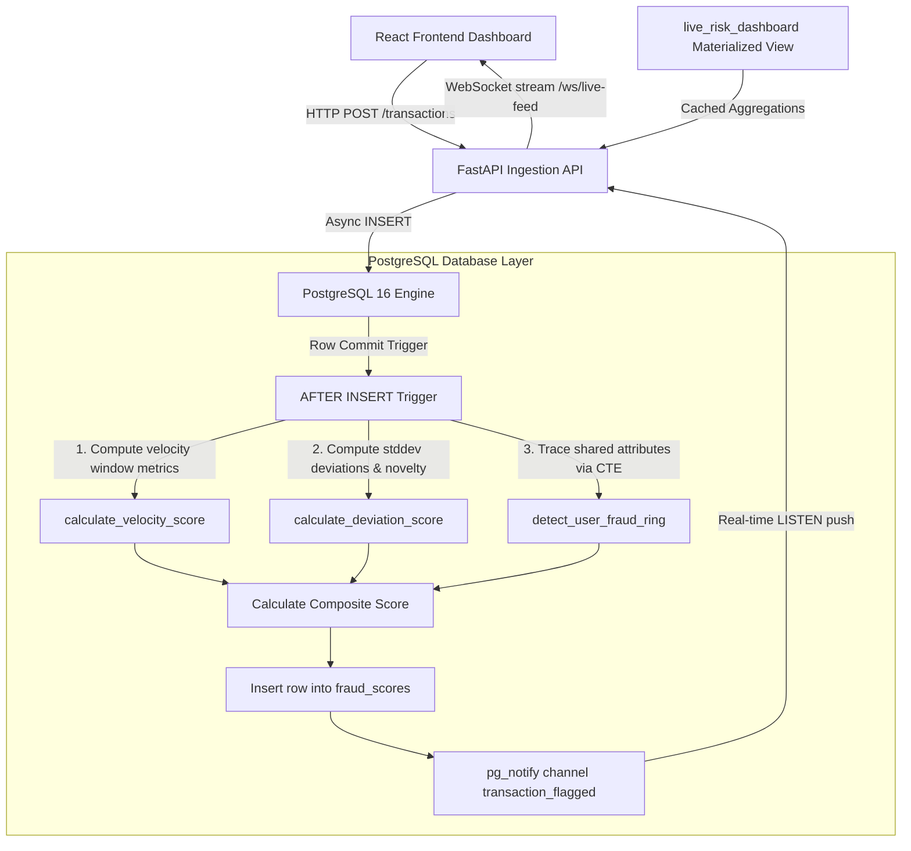

# FraudNet 🛡️ — SQL-Native Real-Time Fraud Detection Engine

FraudNet is an enterprise-grade, real-time financial fraud detection system. The core detection intelligence is executed **entirely inside PostgreSQL 16 (PL/pgSQL)** using triggers, advanced window functions, and recursive Common Table Expressions (CTEs). 

FastAPI serves as a thin ingestion shell that acts as an asynchronous WebSocket bridge, forwarding database events immediately to a modern React dashboard.

---

## 🏗️ Architecture



---

## ⚡ Why SQL-Native? (The Design Tradeoff)

Traditional architectures process fraud logic in application services (e.g., Python or Go worker threads). FraudNet moves this calculation directly to the **PostgreSQL storage layer**.

### Advantages:
1. **Zero Network Round-Trips**: Computing rolling counts, user baselines, and network graphs in application logic requires fetching hundreds of historic records per transaction. In SQL, this data is processed where it resides in memory.
2. **Strict Transaction Isolation & Atomicity**: The score is computed *before* the transaction is fully committed. This prevents race conditions where a high-velocity attack could slip through in a split-second window before a background worker processes it.
3. **Database-Enforced Integrity**: Fraud scores and flagged alerts are generated deterministically for every transaction, regardless of which client, API, or service ingested it.

### Tradeoffs:
- **Horizontal Scaling Constraints**: CPU scaling is shifted to PostgreSQL. Replication or horizontal partitioning is required if the database becomes a write bottleneck.
- **Logic Portability**: Migrating database engines would require rewriting the PL/pgSQL procedures.

---

## 🕸️ The Recursive CTE Fraud Ring Bug (An Engineering Story)

The centerpiece of FraudNet is its graph-based fraud ring discovery logic. A fraud ring is a cluster of users linked by shared attributes: same `device_id`, same `ip_address`, or credit cards sharing the same `last_four` digits.

### The Problem: Exponential Path Explosion
Initially, the recursive CTE in `detect_fraud_rings()` was implemented using a `UNION ALL` statement with cycle prevention using a path-tracking array:
```sql
graph_search(start_user, curr_user, path) AS (
    SELECT DISTINCT user_a, user_a, ARRAY[user_a] FROM bidirectional_links
    UNION ALL
    SELECT gs.start_user, bl.user_b, gs.path || bl.user_b
    FROM graph_search gs
    JOIN bidirectional_links bl ON gs.curr_user = bl.user_a
    WHERE NOT (bl.user_b = ANY(gs.path))
)
```
While this successfully prevented infinite loops, `UNION ALL` forces the database to traverse **every possible simple path** within a connected component. When the database was populated with the seed dataset (15,000+ transactions), random attribute overlaps created connected components of size up to 69 nodes. Tracing all simple paths in a 69-node dense subgraph is computationally intractable, causing the global query to hang indefinitely.

### The Fix: Linear Connected Components via `UNION`
We replaced `UNION ALL` with **`UNION`** and removed the path-tracking array:
```sql
graph_search(start_user, curr_user) AS (
    SELECT DISTINCT user_a, user_a FROM bidirectional_links
    UNION
    SELECT gs.start_user, bl.user_b
    FROM graph_search gs
    JOIN bidirectional_links bl ON gs.curr_user = bl.user_a
)
```
In SQL recursive CTEs, `UNION` automatically discards duplicate rows `(start_user, curr_user)` from the working stack at each step. This naturally guarantees that each reachable node is only traversed once per starting vertex, reducing the complexity from exponential $O(2^V)$ to linear $O(V + E)$ BFS traversal.

- **Global CTE Query Time**: Reduced from **indefinite hang** to **~6.0 seconds** over 15,000+ transactions.
- **User-Specific CTE Trigger Time**: Reduced to **~0.06 seconds**, keeping transaction commit times fast.

---

## 🔐 Authentication & Security

FraudNet protects key analytical API endpoints behind **JWT Bearer Token** authentication.

### Demo User Credentials & Environment Variables
The authentication system supports environment-driven demo credentials and JWT configuration:

| Variable | Default Value | Description |
| :--- | :--- | :--- |
| `DEMO_USERNAME` | `admin` | Demo login username |
| `DEMO_PASSWORD` | `fraudnet123` | Demo login password |
| `JWT_SECRET_KEY` | `fraudnet-secret-key-change-in-production` | Secret key used to sign JWTs |
| `JWT_ALGORITHM` | `HS256` | Algorithm used for JWT encoding |
| `ACCESS_TOKEN_EXPIRE_MINUTES` | `60` | Token expiration time in minutes |

### Obtaining an Access Token
Send a `POST` request to `/auth/token` with valid credentials:

```bash
# Via JSON payload
curl -X POST "http://localhost:8000/auth/token" \
     -H "Content-Type: application/json" \
     -d '{"username": "admin", "password": "fraudnet123"}'

# Via OAuth2 Form Data
curl -X POST "http://localhost:8000/auth/token" \
     -d "username=admin&password=fraudnet123"
```

**Response:**
```json
{
  "access_token": "eyJhbGciOiJIUzI1Ni...",
  "token_type": "bearer"
}
```

### Accessing Protected Endpoints
Protected endpoints require passing the JWT token in the `Authorization` header:

* `GET /rings` — Retrieves active user clusters identified by the recursive CTE ring algorithm.
* `GET /transactions/{id}/score` — Retrieves the detailed composite risk score breakdown for a transaction.

```bash
# Access protected rings endpoint
curl -X GET "http://localhost:8000/rings" \
     -H "Authorization: Bearer <YOUR_ACCESS_TOKEN>"
```

---

## 🚀 Local Quickstart

### Prerequisites
Make sure you have **Docker Desktop** installed and running on your system.

### Step 1: Spin Up Containers
```bash
# Clone the repository
git clone https://github.com/Rajiv6165/FraudNet.git
cd fraudnet

# Build and start services (database, backend API, React frontend)
docker compose up -d --build
```

### Step 2: Run Migrations and Seed Data
```bash
# Execute Alembic migrations to apply schemas, functions, and triggers
docker compose exec backend alembic upgrade head

# Run seed script to generate 15,000+ mock transactions
docker compose exec backend python seed.py
```

### Step 3: Access Dashboards
- **React Dashboard**: Open [http://localhost:5173](http://localhost:5173)
- **FastAPI docs**: Open [http://localhost:8000/docs](http://localhost:8000/docs)

---

## ☁️ Production Deployment Guide

### Part 1: Backend + Database on Render

Render Blueprints allow deploying the database and FastAPI service concurrently. We have defined a `render.yaml` configuration at the root of the project.

#### Steps to Deploy via Render Dashboard:
1. Push your repository to GitHub.
2. Log in to the [Render Dashboard](https://dashboard.render.com/).
3. Click **New** -> **Blueprint**.
4. Connect your GitHub repository.
5. Render will automatically parse the `render.yaml` file. Review the service configurations:
   - **Postgres Database**: Render will spin up a free-tier database named `fraudnet-db`.
   - **Web Service**: Render will compile the python requirements, run `alembic upgrade head` to configure tables, triggers, and functions, and start the uvicorn service.
6. Click **Apply**.
7. Copy the public **Web Service URL** (e.g. `https://fraudnet-backend.onrender.com`).

*Note: Render supports WebSockets natively. Since the simulator frequently pushes transactions, the connection is kept alive natively. In addition, the FastAPI application implements CORS origins parsing from the `ALLOWED_ORIGINS` environment variable.*

---

### Part 2: Frontend on Vercel

The React application is built using Vite and ready to be hosted as a static site on Vercel.

#### Steps to Deploy via Vercel Dashboard:
1. Log in to [Vercel](https://vercel.com).
2. Click **Add New** -> **Project**.
3. Select your GitHub repository.
4. Configure the **Build & Development Settings**:
   - **Framework Preset**: `Vite` (Vercel auto-detects this).
   - **Root Directory**: `frontend` (Make sure to set this!).
5. Add the **Environment Variables**:
   - Key: `VITE_API_URL`
   - Value: `https://your-backend-render-url.onrender.com` (use the Render Web Service URL copied in the previous step).
6. Click **Deploy**.
7. Vercel will host the dashboard (e.g., `https://fraudnet-frontend.vercel.app`).
8. *(Optional)* Update the backend environment variable `ALLOWED_ORIGINS` in your Render Web Service settings to `https://your-vercel-domain.vercel.app` for strict security instead of `*`.

---

### Part 3: Seed the Production Database

Since the production database starts empty, run the seed script to populate it:

#### Option A: Running inside Render Shell (Recommended)
1. Go to your Render Web Service dashboard for `fraudnet-backend`.
2. Click the **Shell** tab on the left sidebar.
3. Run the following command inside the terminal:
   ```bash
   python seed.py
   ```

#### Option B: Running locally against Render Database
1. Copy the **External Database URL** from the Render database details panel.
2. In your local terminal, navigate to the `backend` folder and run:
   ```bash
   # On Windows (PowerShell)
   $env:SYNC_DATABASE_URL="external_db_connection_string"
   python seed.py

   # On Linux/macOS
   SYNC_DATABASE_URL="external_db_connection_string" python seed.py
   ```
